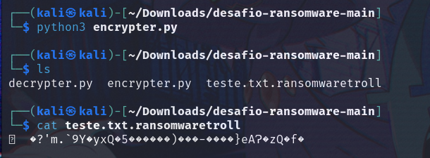
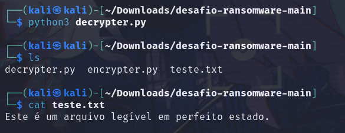

# Desafio Ransomware

- Projeto consiste em um ransomware simples para o desafio do Bootcamp Cybersecurity da Dio.

## Ferramentas
- Kali
- Python

# Uso 
- Encrypter<br>
```python
python3 encrypter.py
```

- Decripter<br>
```python
python3 decrypter.py
```

